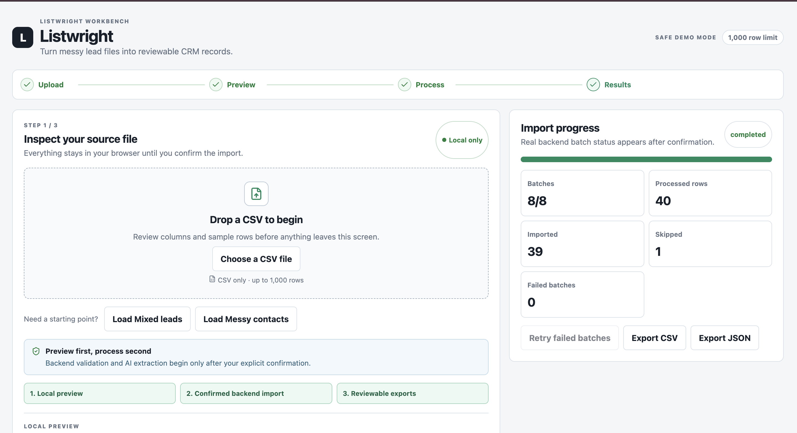
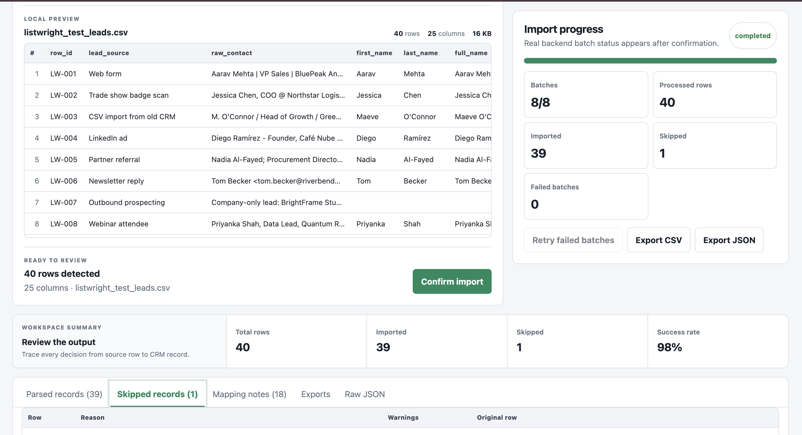
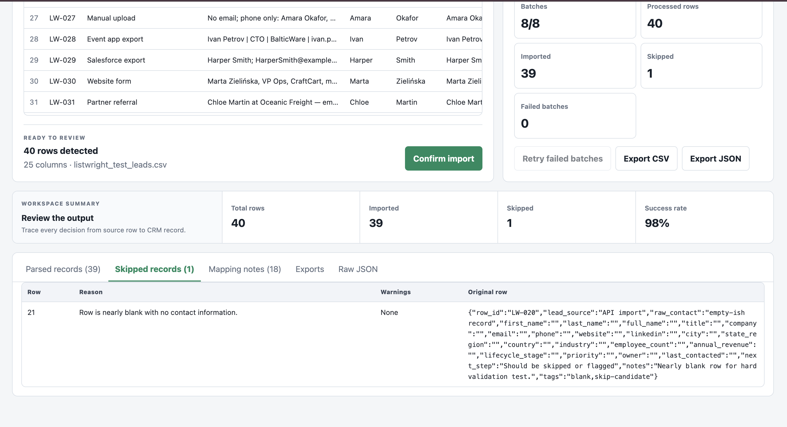
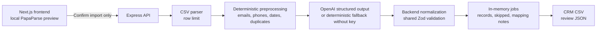

# Listwright

Reviewer-friendly AI CSV importer for messy CRM lead spreadsheets. It previews CSV files locally, waits for explicit confirmation, processes rows through an Express async job, validates every AI-shaped result with shared Zod schemas, and exports Listwright-ready CRM data.

## Live Demo

- **Frontend / Web App:** https://listwright-web.vercel.app/
- **Backend / Render API:** https://listwright-api.onrender.com

## Screenshots

### Upload



### Local preview



### Import results



## Demo Flow

1. Open the web app.
2. Load a sample CSV or choose a local CSV.
3. Review the local preview. No backend or AI import happens before user confirmation.
4. Click **Confirm import**.
5. Watch batch progress, imported count, skipped count, and failed batches.
6. Inspect parsed records, skipped records, mapping notes, warnings, confidence, and before/after row comparisons.
7. Retry failed batches if needed.
8. Export CRM CSV or full review JSON.

## Architecture



## Local Setup

```bash
npm install
cp .env.example .env
npm run dev
```

Frontend: `http://localhost:3000`
Backend: `http://localhost:4000`

The app works without `OPENAI_API_KEY` by using the deterministic extractor. Add `OPENAI_API_KEY` to exercise OpenAI Structured Outputs.

## Environment Variables

Backend:

- `OPENAI_API_KEY`: optional locally, required for true AI extraction.
- `OPENAI_MODEL`: defaults to `gpt-4o-mini`.
- `PORT`: defaults to `4000`.
- `CORS_ORIGIN`: defaults to local frontend in `.env.example`.
- `IMPORT_ROW_LIMIT`: defaults to `1000`.

Frontend:

- `NEXT_PUBLIC_API_BASE_URL`: defaults to `http://localhost:4000`.

## Docker

```bash
docker compose up --build
```

The web container runs on `3000`, the API on `4000`.

## Verification

```bash
npm run typecheck
npm run lint
npm run test
npm run build
```

Optional browser flow:

```bash
PLAYWRIGHT_CLI=playwright-cli npm run test:e2e
```

`test:e2e` builds the app, starts the API and web server, loads the mixed-leads sample in a real browser, confirms import, waits for terminal progress, and verifies CSV/JSON export links. Set `PLAYWRIGHT_CLI` to any executable compatible with the `playwright-cli` command interface.

## Evaluation Readiness

- **AI prompt engineering:** each batch prompt includes the target CRM schema, allowed enum values, skip rules, deterministic signals, ambiguity handling, and a no-invention rule. Responses are checked again with a runtime Zod schema before normalization.
- **Field extraction and mapping:** deterministic preprocessing detects emails, phones, dates, duplicate rows, likely status/source values, and extra contacts. Header aliases and value evidence guide mapping, while ambiguous mappings are surfaced as notes instead of silently guessed.
- **Backend quality:** Express routes use stable contracts, bounded multipart uploads, row limits, safe filenames, security headers, paginated result endpoints, async batch processing, terminal status tracking, and retryable failed batches.
- **Frontend quality:** the Next.js UI has local-only preview, drag-and-drop upload, a four-step workflow, sticky scrollable tables, progress metrics, parsed/skipped/mapping/raw JSON views, exports, accessible empty states, and Sonner feedback.
- **Code quality:** TypeScript is checked across workspaces, shared Zod schemas define API boundaries, importer-specific UI pieces live under `apps/web/src/components/importer/`, and backend behavior is covered by unit tests.
- **Production notes:** Dockerfiles and Compose are included. Jobs are intentionally in memory for the demo, so a deployed instance should remain single-node until Postgres and a durable queue replace the current store.

Bonus coverage: drag-and-drop, progress indicators, retry failed batches, Docker setup, unit tests, and an end-to-end sample flow are implemented. Streaming parsing, table virtualization, dark mode, and durable deployment infrastructure are intentionally out of scope for the reviewer-fast demo.

## Reviewer Smoke Test

Deterministic fallback:

1. Leave `OPENAI_API_KEY` blank in `.env`.
2. Run `npm run dev`.
3. Open `http://localhost:3000`.
4. Load **Mixed leads**, confirm import, inspect parsed/skipped records, then export CSV and JSON.

OpenAI structured extraction:

1. Add `OPENAI_API_KEY` to `.env`.
2. Optionally set `OPENAI_MODEL`.
3. Run `npm run dev`.
4. Repeat the sample flow and verify the same backend validation, warnings, mapping notes, and exports remain visible.

## Deployment

Recommended:

- Frontend: Vercel, set `NEXT_PUBLIC_API_BASE_URL` to the backend URL.
- Backend: Render or Railway, set `OPENAI_API_KEY`, `OPENAI_MODEL`, `IMPORT_ROW_LIMIT`, and `CORS_ORIGIN`.

Use one backend instance on Render/Railway because jobs are in memory. In-memory jobs reset on server restart; production would use Postgres for job/results storage and Redis or a queue for background processing state.

## API

- `GET /health`
- `POST /api/imports`
- `GET /api/imports/:jobId`
- `GET /api/imports/:jobId/records?page=1&limit=100`
- `GET /api/imports/:jobId/skipped?page=1&limit=100`
- `POST /api/imports/:jobId/retry`
- `GET /api/imports/:jobId/export.csv`
- `GET /api/imports/:jobId/export.json`

## Validation And Safety

- No AI/backend import happens before user confirmation.
- LLM output is treated as untrusted and validated with shared Zod schemas.
- The backend owns final normalization, skip rules, confidence/warnings, traceability, and exports.
- Records are skipped only when both email and mobile are missing.
- `crm_status` and `data_source` must be allowed values or blank.
- `created_at` must be parseable by `new Date(created_at)` or blank.
- The first email/mobile becomes primary; extras go into `crm_note`.
- CRM CSV export contains exactly:

```csv
created_at,name,email,country_code,mobile_without_country_code,company,city,state,country,lead_owner,crm_status,crm_note,data_source,possession_time,description
```

Confidence, warnings, original rows, and mapping notes appear only in the UI and JSON export.

## Sample CSVs

Sample files live in `samples/` and are also exposed to the frontend under `apps/web/public/samples/`:

- `mixed-leads.csv`
- `messy-contacts.csv`

## Tradeoffs

- In-memory jobs keep the reviewer demo simple, but they reset on restart and require a single backend instance.
- The deterministic fallback makes local review possible without credentials. With `OPENAI_API_KEY`, the API attempts structured LLM mapping in five-row batches so timeouts remain isolated and retry resends only small failed batches. Every output still passes backend validation.
- Frontend virtualization is intentionally lightweight: preview rendering is capped for review speed while backend processing honors `IMPORT_ROW_LIMIT`.
- No auth, Postgres, Prisma, admin views, import history, billing, workspaces, or CRM write-back are included.
