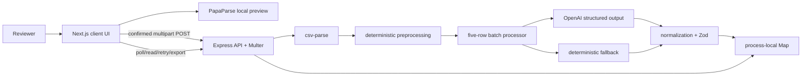
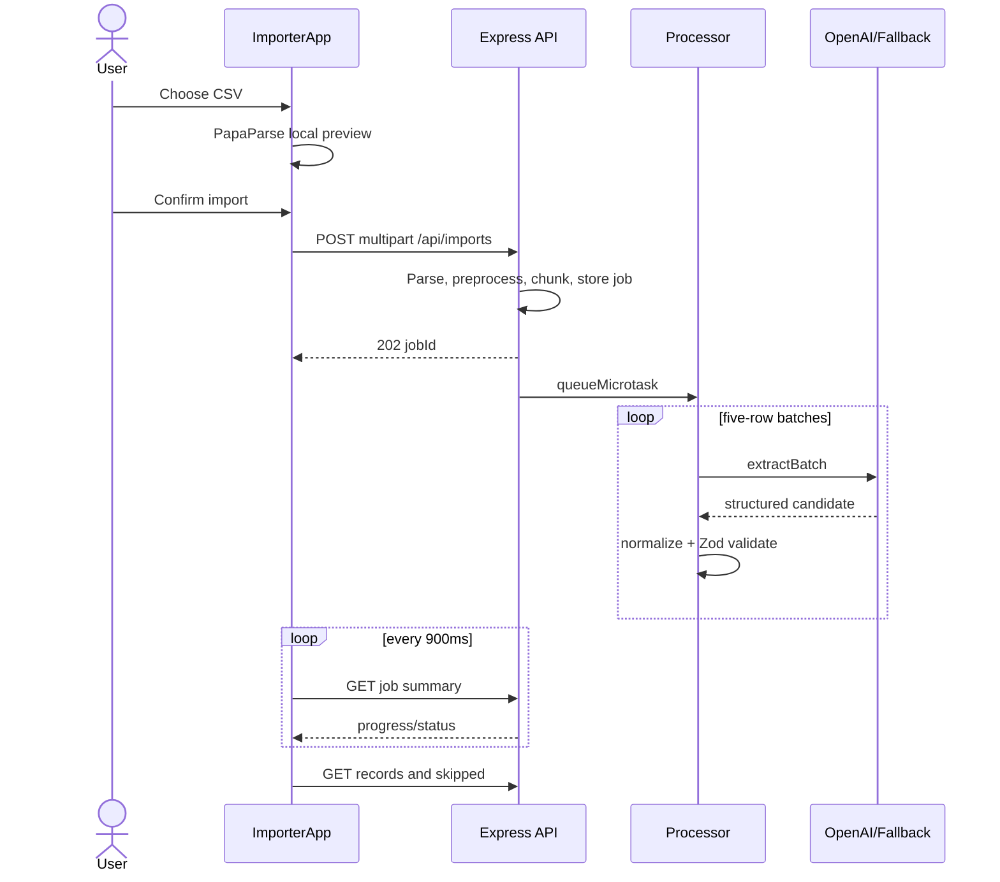

# 1. Project interview summary

## What Listwright is

Listwright is a reviewer-oriented CSV cleanup workbench for messy CRM lead data. A user selects a CSV, inspects a browser-only preview, explicitly confirms processing, then reviews normalized CRM records, skipped rows, mapping evidence, warnings, confidence scores, and before/after data. The result can be exported as a strict CRM CSV or a richer audit JSON. This purpose is stated in the package metadata and product copy (`package.json:2-5`, `PRODUCT.md:9-17`) and implemented by the single-page importer (`apps/web/src/components/ImporterApp.tsx:43-204`) and Express API (`apps/api/src/app.ts:18-159`).

The target user in this version is primarily a technical reviewer or evaluator, not a multi-tenant production CRM customer (`PRODUCT.md:9-17`). The project deliberately avoids signup, billing, history, and direct CRM write-back (`README.md:172-177`). Its value is a fast, auditable demonstration of how probabilistic AI can assist data mapping without being trusted as the final authority.

## Core user flow and value

1. The browser parses a chosen file locally with PapaParse; no upload occurs yet (`apps/web/src/components/ImporterApp.tsx:71-95`).
2. The user confirms, and the browser sends the original `File` as multipart form data (`apps/web/src/components/ImporterApp.tsx:112-134`).
3. The API limits and parses the file, derives deterministic signals, creates five-row batches, stores an in-memory job, and returns HTTP 202 (`apps/api/src/app.ts:43-92`; `apps/api/src/parsing/preprocess.ts:12-35`).
4. Each batch uses OpenAI Structured Outputs when a key exists, otherwise a deterministic mapper (`apps/api/src/ai/openai.ts:95-154`).
5. The backend normalizes and validates every result before it enters job state (`apps/api/src/validation/normalize.ts:20-89`).
6. The UI polls job status and loads paginated results (`apps/web/src/components/ImporterApp.tsx:180-204`).
7. The user reviews evidence and downloads CSV or JSON (`apps/web/src/components/ImporterApp.tsx:415-580`; `apps/api/src/app.ts:129-142`).

Business value: it reduces manual spreadsheet cleanup while preserving human review. Its strongest design idea is the trust boundary: AI proposes; deterministic backend code decides what is valid and exportable.

## Technical stack

| Area | Actual implementation |
|---|---|
| Monorepo | npm workspaces for `apps/*` and `packages/*` (`package.json:6-18`) |
| Frontend | Next.js 16 App Router, React 19, TypeScript (`apps/web/package.json:14-23`) |
| Backend | Node 20, Express 4, Multer, `csv-parse` (`apps/api/package.json:16-22`) |
| Contracts | Shared Zod schemas and TypeScript inference (`packages/shared/src/schemas.ts:1-146`) |
| AI | Direct OpenAI Chat Completions HTTP call with JSON Schema structured output; deterministic fallback (`apps/api/src/ai/openai.ts:11-154`) |
| State | React local state in the browser; process-local `Map` on the API (`apps/web/src/components/ImporterApp.tsx:43-60`; `apps/api/src/jobs/store.ts:1-42`) |
| Tests | Node test runner unit/behavior tests and an optional browser CLI flow (`apps/api/src/app.test.ts:1-290`; `scripts/e2e-sample-flow.mjs:1-166`) |
| Runtime | Two Docker images or separate Next/Express processes (`Dockerfile.api:1-23`; `Dockerfile.web:1-26`) |

The hardest engineering parts are mapping ambiguous headers and values without inventing data; constraining and re-validating LLM output; preserving row-level traceability; modeling asynchronous progress and partial failure; and keeping the no-AI fallback behaviorally compatible.

## What to highlight

- The explicit preview/confirmation privacy boundary (`apps/web/src/components/ImporterApp.tsx:71-134`).
- Defense in depth: JSON Schema at the provider, Zod at the AI boundary, deterministic normalization, then final shared schema validation (`apps/api/src/ai/openai.ts:11-93`; `apps/api/src/validation/normalize.ts:20-85`).
- Small failure domains: batches contain five rows, and one failed batch does not stop later batches (`apps/api/src/parsing/preprocess.ts:29-35`; `apps/api/src/jobs/processor.ts:28-58`).
- Auditable output: original row, confidence, warnings, and mapping notes remain reviewable (`packages/shared/src/schemas.ts:32-58`; `apps/web/src/components/ImporterApp.tsx:441-466`).
- Honest scope: this is a single-instance demo, not durable multi-user infrastructure (`README.md:127-135`).

## Interview pitches

**30 seconds:** “Listwright is an auditable AI-assisted CSV importer for messy CRM lead files. The browser previews the file locally and uploads only after confirmation. The Express API extracts deterministic signals, processes five-row batches through OpenAI structured output or a local fallback, then normalizes and validates everything with shared Zod contracts. Users can inspect before/after rows, warnings, skips, and mappings before exporting. I deliberately kept jobs in memory for demo speed, so I can clearly explain the path to durable production infrastructure.”

**60 seconds:** “The problem is that CRM spreadsheets have inconsistent headers, mixed contact fields, invalid enums, and missing values. Listwright separates deterministic facts from probabilistic mapping. React and PapaParse provide a local preview. After consent, Express and Multer accept a bounded CSV, `csv-parse` reads it, preprocessing finds emails, phones, dates, duplicates, and allowed enum hints, and the processor handles five-row batches. With an OpenAI key it requests strict JSON Schema output; without one it uses a deterministic header mapper. Crucially, neither result is trusted: backend normalization applies contact precedence, allowed values, skip rules, and shared Zod validation. The UI polls progress and exposes traceable results and exports. Current state is process-local and unauthenticated, which is appropriate for the evaluator demo but not multi-user production.”

**2 minutes:** Use the 60-second pitch, then add: “The architecture is an npm-workspace monorepo with a shared contract package, so frontend and backend use the same job and record vocabulary. A job owns batches, imported records, skipped records, mapping notes, and errors. The POST endpoint returns 202 immediately and schedules work with `queueMicrotask`; polling reads a summary while separate endpoints paginate records and skipped rows. Batch failure is isolated, marked retryable, and can be requeued. The strongest engineering decision is to make the LLM an untrusted adapter: provider JSON Schema reduces malformed output, backend Zod validates its shape, and normalization still owns enum allowlists, parseable dates, primary contacts, and final skip decisions. The main limitations are no persistence, ownership, rate limiting, observability, or true queue. For production I would add authenticated ownership, Postgres for jobs/results, object storage or immediate discard policies for uploads, a durable queue with leases and idempotency, structured logs/metrics, and integration/evaluation tests.”

# 2. Prerequisites I must know before explaining this project

## Client-server architecture and HTTP

A client renders interaction and sends requests; a server applies trusted business rules and returns responses. Here, Next.js renders the page (`apps/web/src/app/page.tsx:1-5`), `apiFetch` sends HTTP requests (`apps/web/src/lib/api.ts:1-19`), and Express registers handlers (`apps/api/src/app.ts:18-159`). HTTP methods communicate intent: GET reads, POST creates or triggers work. Status 202 means accepted for asynchronous processing (`apps/api/src/app.ts:85-87`); 400 means invalid input, 404 missing job/route, 415 unsupported media type, and 500 unexpected server failure (`apps/api/src/app.ts:43-52`, `181-187`, `144-157`).

Interview phrasing: “The browser is not the trust boundary. It improves UX with local preview, but the API independently parses, normalizes, and validates the uploaded file.”

## REST and JSON contracts

REST-style routes model resources—in this case imports and their subresources. Most responses are JSON; exports are CSV or JSON downloads (`apps/api/src/app.ts:94-142`). A contract specifies required fields and types. Shared Zod schemas are executable contracts for records, summaries, pagination, and exports (`packages/shared/src/schemas.ts:12-146`). The frontend mostly uses inferred TypeScript types, but it does **not** runtime-parse API responses, an improvement opportunity (`apps/web/src/components/ImporterApp.tsx:6-10`; `apps/web/src/lib/api.ts:7-18`).

## Multipart upload and parsing

JSON is poor for raw files, so the browser uses `FormData` and the server uses Multer’s multipart parser (`apps/web/src/components/ImporterApp.tsx:120-124`; `apps/api/src/app.ts:27-30`, `43`). Memory storage avoids temp files but holds the entire upload in RAM; the 5 MB cap bounds this risk. `csv-parse` interprets the header as object keys and tolerates unequal column counts (`apps/api/src/parsing/csv.ts:3-24`).

## Validation, normalization, and sanitization

Validation asks whether data satisfies a contract. Normalization converts variants into a canonical representation. Sanitization removes or neutralizes problematic content. The project does all three: Zod validates (`packages/shared/src/schemas.ts:5-125`), normalization handles phones/enums/dates (`apps/api/src/validation/normalize.ts:91-140`), and newlines/file-name metacharacters are removed (`apps/api/src/app.ts:65`; `packages/shared/src/schemas.ts:5`). Say: “TypeScript disappears at runtime; Zod protects runtime boundaries.”

## Asynchrony, jobs, batches, retries, and idempotency

An asynchronous API accepts work before it finishes. A job tracks overall state; batches reduce latency and failure scope (`apps/api/src/types.ts:27-57`). `queueMicrotask` defers work until the current JavaScript stack completes, but it is not a queue, worker, or durable background system (`apps/api/src/jobs/processor.ts:20-24`). Processing is sequential (`apps/api/src/jobs/processor.ts:32-58`). Retrying requeues only failed batches (`apps/api/src/app.ts:114-127`). There is no idempotency key: repeated uploads create independent jobs, and concurrent retry calls can process the same batch twice. Be ready to define idempotency as “repeating the same logical request has the same effect.”

## In-memory data model versus database

The `Map<string, ImportJob>` is an in-process key/value store, not a database (`apps/api/src/jobs/store.ts:1-3`). There are no tables, migrations, ORM, SQL, transactions, foreign keys, or indexes. Restarting loses all state; multiple instances see different jobs. The design documents explicitly acknowledge no database (`docs/05_BACKEND_SCHEMA.md:3-7`). Never claim Postgres or Prisma is implemented.

## AI structured output and grounding

An LLM predicts text; structured output constrains that text to a JSON Schema. The request uses `response_format.type = json_schema` with strict mode (`apps/api/src/ai/openai.ts:100-141`). Grounding means tying output to supplied evidence. The prompt sends original rows plus deterministic signals and explicitly forbids invention (`apps/api/src/ai/openai.ts:118-139`). Structured shape does not guarantee factual correctness, so backend code re-validates and normalizes (`apps/api/src/ai/openai.ts:149-154`; `apps/api/src/validation/normalize.ts:20-89`). There is no RAG, embedding, vector store, tool calling, streaming, reranking, citation engine, or eval framework.

## React state, effects, and Next.js component boundaries

`page.tsx` is a server component by default, but it only returns `ImporterApp` (`apps/web/src/app/page.tsx:1-5`). `ImporterApp` declares `"use client"` because it needs file APIs, hooks, effects, and event handlers (`apps/web/src/components/ImporterApp.tsx:1-17`). `useState` stores workflow state, `useMemo` derives progress, `useCallback` stabilizes file parsing, and `useEffect` manages polling/result fetching (`apps/web/src/components/ImporterApp.tsx:43-69`, `71-95`, `180-204`). There is no Redux or global client store.

## CORS, CSRF, XSS, authentication, and authorization

CORS is a browser policy controlling which origins can read cross-origin responses; configured origins are normalized and passed to middleware (`apps/api/src/app.ts:36`, `162-172`). Authentication proves identity; authorization decides access. Neither exists. Anyone who knows a job UUID can read, retry, or export it (`apps/api/src/app.ts:94-142`, `181-187`). CSRF is less relevant without cookie authentication, but would matter after cookie sessions are added. React escapes rendered strings, reducing normal XSS risk; exported CSV still deserves spreadsheet-formula injection protection, which is currently absent (`apps/api/src/exports/format.ts:24-30`).

## Error handling, testing, configuration, and deployment

Exceptions represent failed operations. Route-local parsing errors become 400; Multer errors become 400; unknown middleware errors become a generic 500 (`apps/api/src/app.ts:55-91`, `148-157`). Batch errors are retained as retryable job errors (`apps/api/src/jobs/processor.ts:38-55`). Environment variables separate deployment configuration from code (`.env.example:1-9`). Unit tests exercise pure and orchestration functions (`apps/api/src/app.test.ts:16-203`); the browser flow builds and launches both apps (`scripts/e2e-sample-flow.mjs:11-63`). Docker images create reproducible runtimes (`Dockerfile.api:1-23`; `Dockerfile.web:1-26`).

# 3. High-level architecture

The frontend layer is one App Router page and a client-side workflow (`apps/web/src/app/page.tsx:1-5`; `apps/web/src/components/ImporterApp.tsx:43-352`). The API layer owns upload limits, routes, CORS, and error middleware (`apps/api/src/app.ts:18-159`). Parsing and preprocessing are separate deterministic modules (`apps/api/src/parsing/csv.ts:1-25`; `apps/api/src/parsing/preprocess.ts:1-103`). AI adaptation and fallback live behind `extractBatch` (`apps/api/src/ai/openai.ts:95-154`). Final domain enforcement lives in normalization and shared schemas (`apps/api/src/validation/normalize.ts:20-159`; `packages/shared/src/schemas.ts:1-146`). State is a module-level Map (`apps/api/src/jobs/store.ts:3`). Runtime consists of separate web and API processes (`docker-compose.yml:1-26`). No auth, DB, cache, durable queue, webhook, cron, or separate worker exists.

# 4. Repository map

| Path | Role and interview relevance |
|---|---|
| `package.json:1-23` | Workspace root and orchestration scripts; establishes Node 20. |
| `packages/shared/src/constants.ts:1-51` | Canonical columns, enums, statuses, and row cap. |
| `packages/shared/src/schemas.ts:1-146` | Runtime API/domain contracts and inferred TS types. |
| `apps/api/src/index.ts:1-8` | API entrypoint; creates and listens on Express app. |
| `apps/api/src/app.ts:18-200` | Middleware, every HTTP route, upload policy, pagination, errors. |
| `apps/api/src/types.ts:8-105` | Internal source-row, batch, job, and AI adapter types. |
| `apps/api/src/parsing/csv.ts:1-25` | CSV bytes to bounded sanitized row objects. |
| `apps/api/src/parsing/preprocess.ts:8-103` | Detects contacts, dates, duplicates, enum hints; chunks rows. |
| `apps/api/src/ai/deterministic.ts:9-120` | Credential-free header/value mapper and mapping notes. |
| `apps/api/src/ai/openai.ts:11-154` | Provider JSON Schema, prompt, timeout, parsing, Zod validation, fallback selection. |
| `apps/api/src/validation/normalize.ts:20-159` | Final business rules and domain validation. |
| `apps/api/src/jobs/processor.ts:8-58` | Batch creation and sequential asynchronous orchestration. |
| `apps/api/src/jobs/store.ts:3-42` | Process-local state, summaries, derived counts/status. |
| `apps/api/src/exports/format.ts:6-30` | Exact CSV and audit JSON generation. |
| `apps/api/src/app.test.ts:16-290` | Backend behavior tests and fixtures. |
| `apps/web/src/app/layout.tsx:1-19` | Metadata, root document, toast host. |
| `apps/web/src/app/page.tsx:1-5` | Only route/page. |
| `apps/web/src/components/ImporterApp.tsx:1-606` | Main UI, local parsing, API lifecycle, polling, tabs and tables. |
| `apps/web/src/components/importer/UploadDropzone.tsx:1-51` | File picker/drop target and sample actions. |
| `apps/web/src/components/importer/ImporterStepper.tsx:1-26` | Accessible progress navigation. |
| `apps/web/src/lib/api.ts:1-19` | Base URL, exports, fetch/error wrapper. |
| `apps/web/src/app/globals.css:1-170` | Design tokens, responsive layout, focus, tables, status styles. |
| `scripts/e2e-sample-flow.mjs:1-166` | Build/start/browser smoke test harness. |
| `Dockerfile.*`, `docker-compose.yml` | Production-like build and two-process local deployment. |
| `.env.example:1-9` | Complete documented runtime configuration. |
| `docs/01_PRD.md`–`06_IMPLEMENTATION_PLAN.md` | Product/design intent; useful context, but running code is authoritative. |
| `samples/`, `apps/web/public/samples/` | CLI/repository fixtures and browser-served demo copies. |

Generated `.next`, `dist`, `node_modules`, TypeScript build info, Playwright logs/snapshots, images, lockfile internals, and `.DS_Store` are not business logic. The lockfile is still important for reproducible dependency resolution.

# 5. Runtime and startup flow

`npm run dev` runs each workspace’s `dev` script if present (`package.json:10-18`). Shared has a TypeScript watcher/build script; API uses `tsx watch src/index.ts`; web uses `next dev -p 3000` (`apps/api/package.json:7-14`; `apps/web/package.json:6-12`). The API reads `PORT`, calls `createApp`, then listens (`apps/api/src/index.ts:1-8`). `createApp` installs security headers, Multer, row-limit configuration, CORS, JSON parsing, routes, 404 handling, and error middleware in order (`apps/api/src/app.ts:18-159`). No database or auth initialization occurs.

The web App Router loads `layout.tsx`, metadata, global CSS and Toaster, then the `/` page renders the client importer (`apps/web/src/app/layout.tsx:1-19`; `apps/web/src/app/page.tsx:1-5`). `NEXT_PUBLIC_API_BASE_URL` is embedded for browser use, with localhost fallback (`apps/web/src/lib/api.ts:1`).

The API build compiles shared first and then TypeScript; the web build compiles shared first and runs `next build` (`apps/api/package.json:9-14`; `apps/web/package.json:8-12`). Docker uses dependency, build, and runner stages (`Dockerfile.api:1-23`; `Dockerfile.web:1-26`). Compose exposes ports and starts web after the API container is started, but `depends_on` does not prove API readiness (`docker-compose.yml:1-26`).

# 6. Database deep dive

There is **no database implementation**. “Not confirmed from codebase” would be too weak here: the code positively uses a module-level `Map`, and the design explicitly says there is no DB (`apps/api/src/jobs/store.ts:1-3`; `docs/05_BACKEND_SCHEMA.md:3-7`). Therefore there are no models in the ORM sense, migrations, SQL queries, transactions, primary/foreign keys, or indexes.

The in-memory domain entities are:

- `ImportJob`: UUID, lifecycle timestamps/status, filename/limits/counts, batches, errors, imported/skipped results, and notes (`apps/api/src/types.ts:38-57`).
- `ImportBatch`: UUID, ordinal, row range, attempt count, source rows, and state (`apps/api/src/types.ts:27-36`).
- Imported/skipped records and mapping notes are Zod-defined value objects (`packages/shared/src/schemas.ts:32-58`).

Relationships are embedded arrays: a job owns batches/results/notes. IDs are generated with `randomUUID` (`apps/api/src/app.ts:60-85`; `apps/api/src/jobs/processor.ts:8-18`; `apps/api/src/validation/normalize.ts:38-85`). There is no referential integrity beyond application logic.

Potential problems: state vanishes on restart; memory grows without TTL/eviction; raw personal data stays in memory; multi-instance routing breaks; no atomicity protects concurrent retries; no query indexes or history; and anyone with a job ID has access. A production relational design would use `users`, `import_jobs`, `import_batches`, `imported_records`, `skipped_records`, `mapping_notes`, and `job_errors`, with `user_id` ownership, foreign keys, unique idempotency keys, status/timestamp indexes, transactions for batch completion, and retention policies.

Interview answer: “I chose embedded in-memory state to remove database setup from a three-minute evaluator demo. I would not call it production storage. The domain types intentionally make the later Postgres boundary visible.”

# 7. API deep dive

All endpoints are registered in `apps/api/src/app.ts:39-142`. There is no authentication or authorization on any endpoint.

## Endpoint: `GET /health`

**Purpose:** readiness identity check. Handler: `apps/api/src/app.ts:39-41`; response validation: `apps/api/src/app.ts:174-179` and `packages/shared/src/schemas.ts:104-107`. Response: `{status:"ok", service:"listwright-api"}`. It does not verify OpenAI or any durable dependency. Tested at `apps/api/src/app.test.ts:16-21`.

## Endpoint: `POST /api/imports`

**Caller:** `confirmImport` (`apps/web/src/components/ImporterApp.tsx:112-134`). **Request:** multipart field `file`; no JSON body. Multer allows one file, two fields, and 5 MB (`apps/api/src/app.ts:27-30`, `43`). File extension must be `.csv` (`apps/api/src/app.ts:44-53`).

**Execution:** parse bytes with bounded `csv-parse` (`apps/api/src/parsing/csv.ts:3-24`); preprocess signals (`apps/api/src/parsing/preprocess.ts:12-27`); chunk into five and create batch objects (`apps/api/src/parsing/preprocess.ts:29-35`; `apps/api/src/jobs/processor.ts:8-18`); initialize a job, sanitize its filename, and store it (`apps/api/src/app.ts:59-85`); schedule processing and return 202 `{jobId,status,rowLimit}` (`apps/api/src/app.ts:85-87`; schema at `packages/shared/src/schemas.ts:109-113`). Parsing errors return 400 (`apps/api/src/app.ts:88-91`).

Weaknesses: MIME/content signature is not checked, all bytes are held in memory, requests have no identity/rate limit/idempotency, and a CSV at exactly the cap gets a possibly misleading “limit applied” warning because `rows.length >= rowLimit` cannot distinguish truncation (`apps/api/src/app.ts:74-78`).

## Endpoint: `GET /api/imports/:jobId`

Returns `{job: summary}` (`apps/api/src/app.ts:94-98`; contract `packages/shared/src/schemas.ts:67-83`, `115-117`). The UI calls it immediately after creation and every 900 ms until terminal (`apps/web/src/components/ImporterApp.tsx:123-125`, `180-191`). Missing jobs return 404 (`apps/api/src/app.ts:181-187`). UUID obscurity is not authorization.

## Endpoint: `GET /api/imports/:jobId/records`

Returns summary, pagination, and imported records (`apps/api/src/app.ts:100-105`; schema `packages/shared/src/schemas.ts:85-96`). Query defaults are page 1/limit 100; page is at least 1 and limit is capped at 200 (`apps/api/src/app.ts:190-200`). UI caller: `apps/web/src/components/ImporterApp.tsx:193-204`. Fractions such as `page=1.5` are not rounded, producing surprising slice offsets; query validation should use coercing integer Zod schemas.

## Endpoint: `GET /api/imports/:jobId/skipped`

Same pagination behavior for skipped records (`apps/api/src/app.ts:107-112`; contract `packages/shared/src/schemas.ts:98-102`; UI caller `apps/web/src/components/ImporterApp.tsx:193-204`).

## Endpoint: `POST /api/imports/:jobId/retry`

Finds failed batches, returns 200/no-op if none, otherwise marks them queued, recalculates counts, schedules only those batches, and returns 202 (`apps/api/src/app.ts:114-127`). UI caller: `apps/web/src/components/ImporterApp.tsx:136-153`. There is no request body/schema. Race risk: two callers can both observe failed work and start it; no lease, mutex, version, or idempotency token exists.

## Endpoint: `GET /api/imports/:jobId/export.csv`

Maps imported records to CRM values and formats exact ordered columns (`apps/api/src/app.ts:129-135`; `apps/api/src/exports/format.ts:6-12`; columns `packages/shared/src/constants.ts:1-17`). Caller is an anchor generated by `exportUrl` (`apps/web/src/lib/api.ts:3-5`; `apps/web/src/components/ImporterApp.tsx:546-560`). It can export while a job is nonterminal if called directly. CSV quoting handles comma/quote/newline but does not neutralize spreadsheet formulas (`apps/api/src/exports/format.ts:24-30`).

## Endpoint: `GET /api/imports/:jobId/export.json`

Returns timestamp, summary, all records/skips/notes (`apps/api/src/app.ts:137-142`; `apps/api/src/exports/format.ts:14-22`; schema `packages/shared/src/schemas.ts:119-125`). Unlike the raw UI tab, the download contains all pages. Same access and lifecycle weaknesses apply.

# 8. Frontend deep dive

There is one screen at `/`. `Home` renders `ImporterApp` (`apps/web/src/app/page.tsx:1-5`). The root layout supplies metadata and the global toast host (`apps/web/src/app/layout.tsx:1-19`).

`ImporterApp` manages preview, job, result pages, pagination, active tab, expanded row, busy state, and errors locally (`apps/web/src/components/ImporterApp.tsx:43-60`). Derived values compute progress, terminal state, workflow step, and success rate (`apps/web/src/components/ImporterApp.tsx:62-69`).

Major screen areas:

- Upload/preview: dropzone validates file selection and sample buttons (`apps/web/src/components/importer/UploadDropzone.tsx:6-50`). PapaParse reads locally, sanitizes rows, captures parser notes, and shows up to 80 rows (`apps/web/src/components/ImporterApp.tsx:71-110`, `371-412`). Frontend row count is not capped before preview, so a huge local file can freeze the browser.
- Confirmation: sends original file, resets results/pagination, and fetches initial job (`apps/web/src/components/ImporterApp.tsx:112-134`).
- Progress: a 900 ms interval polls until a terminal status; job metrics and errors are rendered (`apps/web/src/components/ImporterApp.tsx:180-191`, `260-301`).
- Results: imported/skipped pages load when results exist or the job is terminal (`apps/web/src/components/ImporterApp.tsx:193-204`). Tabs implement ARIA roles and arrow/Home/End keyboard navigation (`apps/web/src/components/ImporterApp.tsx:155-178`, `307-349`).
- Traceability: imported rows expand to side-by-side source and CRM JSON (`apps/web/src/components/ImporterApp.tsx:415-473`). Skips and mapping notes expose reasons/evidence (`apps/web/src/components/ImporterApp.tsx:475-544`).
- Exports: anchors download full CSV/JSON from the API (`apps/web/src/components/ImporterApp.tsx:546-564`).

Styling is custom global CSS with tokens, responsive grids, sticky/scrolling tables, focus-visible states, and mobile breakpoints (`apps/web/src/app/globals.css:1-170`). No CSS framework, server actions, route handlers, global state library, or form library is used.

# 9. Auth and security deep dive

Authentication, registration, sessions, JWTs, cookies, password hashing, guards, protected routes, and tenant isolation are **not implemented** (`README.md:172-177`). Every job operation trusts possession of a UUID (`apps/api/src/app.ts:94-142`, `181-187`). This is the largest security limitation because records contain personal contact data.

Implemented controls:

- CORS origin configuration (`apps/api/src/app.ts:36`, `162-172`). CORS is not authentication and does not stop non-browser clients.
- 5 MB/one-file Multer limits and 1,000-row maximum (`apps/api/src/app.ts:27-34`; `packages/shared/src/constants.ts:51`).
- `.csv` extension check and filename sanitization (`apps/api/src/app.ts:49-65`). Content/MIME inspection is missing.
- `X-Content-Type-Options`, no-referrer, no-store, and disabled Express signature (`apps/api/src/app.ts:19-26`). A fuller Helmet/CSP policy is missing.
- Zod/normalization protects domain values (`packages/shared/src/schemas.ts:5-125`; `apps/api/src/validation/normalize.ts:20-159`).
- React text rendering normally escapes untrusted strings. Raw data is stringified into text/pre/code, not injected as HTML (`apps/web/src/components/ImporterApp.tsx:461-462`, `494`, `579`).
- Secrets are server-only environment values; only the public API base URL uses `NEXT_PUBLIC_` (`.env.example:1-9`).

Missing controls: auth/ownership, rate limiting, abuse quotas, retention/TTL, audit log, encryption policy, formula-injection protection, schema validation on API inputs/query params, request IDs, CSP/HSTS, and dependency/security scanning. There is no SQL injection today because there is no SQL. CSRF becomes relevant if cookie auth is introduced.

# 10. Core feature flows end-to-end

## Preview and confirmed import

Exact chain: file UI `apps/web/src/components/importer/UploadDropzone.tsx:17-33`; local parse `apps/web/src/components/ImporterApp.tsx:71-95`; confirmation `apps/web/src/components/ImporterApp.tsx:112-134`; upload route `apps/api/src/app.ts:43-92`; CSV parse `apps/api/src/parsing/csv.ts:3-24`; signals/chunks `apps/api/src/parsing/preprocess.ts:12-88`; batches `apps/api/src/jobs/processor.ts:8-58`; AI/fallback `apps/api/src/ai/openai.ts:95-154`; normalization `apps/api/src/validation/normalize.ts:20-89`; polling/results `apps/web/src/components/ImporterApp.tsx:180-204`.

Failure cases include local parse errors, unreachable API, invalid/large/non-CSV upload, malformed CSV, provider timeout/error/invalid output, and missing job after restart. Say: “The 202/polling design keeps request latency independent of processing time, although the current worker is process-local.”

## Retry flow

User clicks retry (`apps/web/src/components/ImporterApp.tsx:136-153`, `289-292`); API selects only failed batches and marks them queued (`apps/api/src/app.ts:114-127`); processor reruns them (`apps/api/src/jobs/processor.ts:28-58`); completed records remain. This is tested (`apps/api/src/app.test.ts:133-192`). Errors are appended rather than cleared, so historical failure messages remain visible after success.

## Export flow

The UI unlocks links only at terminal state (`apps/web/src/components/ImporterApp.tsx:66-68`, `546-564`), but the server itself does not enforce terminal state (`apps/api/src/app.ts:129-142`). CSV includes only canonical fields; JSON includes audit metadata (`apps/api/src/exports/format.ts:6-22`).

# 11. Important functions/classes/modules explained

There are no classes. The important modules favor pure functions and explicit data types.

| Function/module | Inputs → outputs; purpose, edge cases, oral explanation |
|---|---|
| `createApp` (`apps/api/src/app.ts:18-160`) | Options → Express app. Composes all middleware/routes. Removing it removes the API. Row-limit env is clamped to 1,000. Say: “It is an app factory, which makes config injectable and helpers testable without binding a port.” |
| `parseCsvBuffer` (`apps/api/src/parsing/csv.ts:3-24`) | Buffer + cap → clean row objects. Rejects zero data rows, preserves empty lines as rows, tolerates uneven columns. It does not prove encoding/content safety. |
| `preprocessRows` (`apps/api/src/parsing/preprocess.ts:12-27`) | Raw rows → numbered source rows with deterministic evidence. Duplicate signature depends on key insertion order and exact normalized text. |
| `detectSignals` (`apps/api/src/parsing/preprocess.ts:45-88`) | Row + duplicate flag → contacts/dates/enums/warnings. Regex heuristics are explainable but can misclassify international phones/dates. |
| `chunkRows` (`apps/api/src/parsing/preprocess.ts:29-35`) | Source rows → arrays of five by default. Controls LLM failure domain and request size. Invalid size 0 would loop forever; it is only called with default internally. |
| `extractDeterministically` (`apps/api/src/ai/deterministic.ts:27-53`) | Rows + batch ID → AI-shaped result. Makes local demo possible and shares downstream validation. |
| `buildCrm` (`apps/api/src/ai/deterministic.ts:55-82`) | One source row → candidate CRM record. Header substring matching can choose the first ambiguous column and phone normalization assumes the last 10 digits. |
| `extractBatch` (`apps/api/src/ai/openai.ts:95-154`) | Rows + batch ID → candidate result. Chooses provider or fallback, times out at 45s, validates JSON. It does not retry/fallback when a configured provider fails. |
| `normalizeBatchResult` (`apps/api/src/validation/normalize.ts:20-89`) | Untrusted candidate + authoritative rows → imported/skipped/notes. This is the main trust boundary and ensures every input row becomes imported or skipped. |
| `normalizeCrm` (`apps/api/src/validation/normalize.ts:91-122`) | Candidate + deterministic row → canonical CRM. Deterministic email/phone override AI values, enums are allowlisted, invalid dates blank out, extras move to notes. |
| `createBatches` (`apps/api/src/jobs/processor.ts:8-18`) | Row chunks → stateful batch records with UUIDs/ranges. |
| `startJobProcessing` (`apps/api/src/jobs/processor.ts:20-24`) | Job/batches → schedules a microtask; returns immediately. Side effect mutates shared job. Not durable background execution. |
| `processBatches` (`apps/api/src/jobs/processor.ts:28-58`) | Job + batches + injectable extractor → Promise<void>. Sequentially mutates state, isolates failures, records retryable errors. Injectable extractor makes timeout behavior testable. |
| `updateCounts` (`apps/api/src/jobs/store.ts:25-42`) | Job → mutates derived counts/status/time. Centralizes the state machine but has no transition guard/locking. |
| `paginate` (`apps/api/src/app.ts:190-200`) | Array + untrusted query values → slice/metadata. Caps limit at 200; should require integers and probably return 0 total pages for empty results depending contract choice. |
| `formatCrmCsv` (`apps/api/src/exports/format.ts:6-12`) | CRM records → ordered CSV. Relies on `quoteCsv`; needs formula-injection defense. |
| `apiFetch` (`apps/web/src/lib/api.ts:7-19`) | Path/init → typed JSON Promise. Converts network/non-2xx errors; generic type is compile-time assertion, not runtime validation. |
| `ImporterApp` (`apps/web/src/components/ImporterApp.tsx:43-352`) | No props → full workbench. Owns all UI state/effects. Easy for a demo, but 600 lines and mixed responsibilities make it harder to test/extend. |

# 12. AI/LLM-specific deep dive if present

The provider is OpenAI Chat Completions at `/v1/chat/completions`; model defaults to `gpt-4o-mini` and is configurable (`apps/api/src/ai/openai.ts:100-109`; `.env.example:2-3`). The project deliberately uses no SDK.

Input preprocessing supplies row numbers, raw values, and deterministic signals (`apps/api/src/types.ts:21-25`; `apps/api/src/parsing/preprocess.ts:45-88`). Batches contain five rows (`apps/api/src/parsing/preprocess.ts:29-35`). The system prompt defines exact fields, enum allowlists, skip rules, ambiguity behavior, and a no-invention rule; user content is serialized `{batchId, rows}` (`apps/api/src/ai/openai.ts:118-139`).

Output is constrained twice: provider JSON Schema requires all exact fields and forbids extras (`apps/api/src/ai/openai.ts:11-67`), and a strict Zod schema validates parsed content (`apps/api/src/ai/openai.ts:69-93`, `149-154`). Final normalization is a third boundary (`apps/api/src/validation/normalize.ts:20-159`). This is strong defense in depth.

Weaknesses: no provider retry/backoff, fallback on provider failure, model refusal handling, token/cost accounting, prompt versioning, response logging/redaction, eval corpus, quality metrics, or semantic confidence calibration. The returned “confidence” is model/self-assigned or heuristic and should not be described as a measured probability (`apps/api/src/ai/deterministic.ts:43-49`; `apps/api/src/ai/openai.ts:28-30`). A provider error body fragment is stored/displayed and could leak provider detail (`apps/api/src/ai/openai.ts:144-147`; `apps/api/src/jobs/processor.ts:45-54`).

Latency is sequential batches × provider latency, up to roughly 45 seconds per failed batch; 1,000 rows means 200 calls. Cost grows linearly with row count and wide row payloads. Production would add concurrency with limits, retry policy for transient statuses, circuit breaking, token budgets, redaction, evals, and perhaps deterministic-first routing.

There is no RAG, ingestion/chunking for retrieval, embeddings, vector database, reranker, agent, tool calling, or streaming. Do not use those terms when presenting this project.

# 13. Error handling and edge cases

API errors use `{error: string}` but there is no shared error schema (`apps/api/src/app.ts:43-52`, `88-91`, `144-157`). Upload/parser errors are 400, unsupported extension 415, absent job 404, and unknown middleware errors 500. Batch errors do not fail the entire loop; they set batch state and append a retryable error (`apps/api/src/jobs/processor.ts:38-58`). The UI wrapper turns network and non-2xx failures into `Error` objects (`apps/web/src/lib/api.ts:7-18`) and renders an alert/toast (`apps/web/src/components/ImporterApp.tsx:225`, `127-130`, `146-149`).

Important edge cases and risks:

- Empty data file is rejected (`apps/api/src/parsing/csv.ts:12-14`), but frontend and backend disagree on empty-line behavior: Papa uses greedy skipping, backend preserves empty lines (`apps/web/src/components/ImporterApp.tsx:78-81`; `apps/api/src/parsing/csv.ts:8`).
- Duplicate rows are warned, not removed (`apps/api/src/parsing/preprocess.ts:12-25`, `70-86`).
- Missing both email and mobile is enforced even if the AI omits or misclassifies the row (`apps/api/src/validation/normalize.ts:49-63`).
- Retry can race and duplicate results because results are appended and there is no batch lease/deduplication (`apps/api/src/app.ts:114-127`; `apps/api/src/jobs/processor.ts:41-43`).
- Result effects have no cancellation; quick job/page changes could apply stale responses (`apps/web/src/components/ImporterApp.tsx:193-204`).
- Polling stops after an error only if state otherwise changes; errors have no backoff (`apps/web/src/components/ImporterApp.tsx:180-191`).
- Server restart makes current UI job IDs return 404 (`apps/api/src/app.ts:181-185`).
- No TTL permits unbounded memory growth (`apps/api/src/jobs/store.ts:3`).
- Direct export is possible before terminal completion (`apps/api/src/app.ts:129-142`).

# 14. Testing deep dive

`npm test` runs workspace tests; API uses Node’s built-in runner through `tsx` (`package.json:13`; `apps/api/package.json:12-14`). Tests cover health identity, CORS normalization, row caps, empty CSV rejection, pagination, required contact skip, extra contacts, enum allowlists, deterministic aliases/mapping evidence, CSV ordering/escaping, selective retry, five-row chunking, timeout isolation, and failed-progress accounting (`apps/api/src/app.test.ts:16-203`). Helper fixtures are at `apps/api/src/app.test.ts:205-290`.

The optional E2E script builds both apps, starts child processes, waits for health, drives a real browser through sample load/confirm/results/exports, and cleans up (`scripts/e2e-sample-flow.mjs:11-63`, `82-166`). Run with `PLAYWRIGHT_CLI=playwright-cli npm run test:e2e` (`package.json:14`; `README.md:92-98`).

Missing tests: actual Express HTTP/multipart integration, Multer limits, 404/500 middleware, OpenAI success/error/invalid JSON with mocked fetch, auth (not implemented), concurrent retries, API response Zod validation, frontend component/unit/accessibility tests, export formula injection, very wide/large/malformed/encoded CSVs, memory cleanup, Docker smoke, and objective AI mapping evals. The browser test checks a happy fallback flow, not real OpenAI.

# 15. Deployment and environment

Local setup is `npm install`, copy `.env.example`, and `npm run dev` (`README.md:48-59`). Required runtime is Node >=20 (`package.json:20-22`). Environment variables are OpenAI key/model, API port, CORS origins, row limit, and public API URL (`.env.example:1-9`). The API does not explicitly load dotenv; success depends on the shell/npm runner/container supplying variables. “Not confirmed from codebase” whether any hosting platform injects a local `.env` into the API process beyond normal runtime conventions.

Docker builds separate API and web images (`Dockerfile.api:1-23`; `Dockerfile.web:1-26`). Compose maps ports and forwards configuration (`docker-compose.yml:1-26`). README reports Vercel and Render URLs and recommends single-instance API deployment (`README.md:5-9`, `127-135`), but provider-specific deployment manifests are absent. Do not claim autoscaling safety: in-memory state requires sticky single-instance behavior and disappears on restart.

Production readiness gaps: durable state/queue, health dependency checks, graceful shutdown/draining, non-root containers, image healthchecks, observability, secrets management evidence, rate limits, auth, retention, backups, and deployment CI are absent.

# 16. Code quality review

## Strong parts

- Clear separation between parsing, preprocessing, provider adapter, normalization, state, and export.
- Shared runtime schemas reduce frontend/backend contract drift (`packages/shared/src/schemas.ts:1-146`).
- Pure functions and injectable extractor enable focused tests (`apps/api/src/jobs/processor.ts:26-40`).
- LLM output is untrusted and repeatedly constrained.
- Small batches isolate failures and expose retry state.
- UI makes consent, traceability, error, empty, progress, pagination, and keyboard states visible.
- README honestly documents many tradeoffs (`README.md:100-109`, `172-177`).

## Weak or risky parts

- `ImporterApp` is a 600-line component mixing orchestration and rendering (`apps/web/src/components/ImporterApp.tsx:43-606`). Extract hooks/components before substantial growth.
- Shared schemas are not actually used to parse frontend responses (`apps/web/src/lib/api.ts:7-18`).
- The state machine is implicit mutation with no concurrency guard (`apps/api/src/jobs/store.ts:25-42`).
- No true queue, persistence, ownership, TTL, or rate limiting.
- AI confidence is not calibrated; mapping notes may reference arbitrary LLM IDs.
- Retry appends old errors and is not concurrency-safe.
- No provider abstraction beyond one function, retry/backoff, or error classification.
- Phone logic assumes 10-digit national numbers (`apps/api/src/validation/normalize.ts:93-95`). Date parsing uses JavaScript’s locale/implementation-sensitive parser (`packages/shared/src/schemas.ts:7-10`).
- Header mapping uses substring/first-match heuristics, which can collide (`apps/api/src/ai/deterministic.ts:84-107`).
- CSV formula injection is unaddressed (`apps/api/src/exports/format.ts:24-30`).
- README line 3 says “Express async job,” which is accurate only loosely; it should never be described as a separate worker (`README.md:3`; `apps/api/src/jobs/processor.ts:20-24`).

Honest response to criticism: “Those are valid boundaries of the demo. I can point to where each shortcut lives and describe the migration: authenticated ownership and Postgres first, durable idempotent queue second, then observability/evals and controlled concurrency.”

# 17. Performance and scalability

At 10 users on one process and small files, performance is straightforward: local preview, 5 MB cap, 1,000 rows, sequential five-row processing, and in-memory reads. At the maximum, one job can make 200 sequential OpenAI calls (`apps/api/src/parsing/preprocess.ts:29-35`; `packages/shared/src/constants.ts:51`), making latency the dominant bottleneck. Wide rows increase prompt size and cost.

There are no DB N+1 queries because there is no DB. The analogous inefficiencies are repeated in-memory scans: `updateCounts` filters batches multiple times after every state change (`apps/api/src/jobs/store.ts:25-40`), and `normalizeBatchResult` uses `result.records.find` for every source row (`apps/api/src/validation/normalize.ts:49-52`). With batch size five these are negligible.

Scaling problems: every job retains original rows and outputs indefinitely; polling creates repeated requests; multiple instances cannot share state; sequential LLM calls create long completion times; no admission/rate control prevents memory/provider-cost exhaustion; frontend parses entire local files and renders up to 80 rows but still stores all rows (`apps/web/src/components/ImporterApp.tsx:78-90`, `400-409`).

Path to 10,000 users: authenticated tenant ownership; object storage or streaming parse; Postgres metadata/results with indexes on owner/status/created time; durable queue with worker leases, retry/backoff/dead-lettering and idempotent batch commits; bounded worker concurrency and provider quotas; TTL/retention; cursor pagination; SSE/WebSocket or adaptive polling; metrics/traces/logs; caching only for safe immutable summaries/exports; and load/eval testing. Caching cannot substitute for durable correctness.

# 18. Interview Q&A bank

**What problem does it solve?** Messy lead spreadsheets require repetitive mapping and validation. Listwright accelerates that work while retaining explicit consent and row-level review.

**Why this stack?** TypeScript across Next and Express plus shared Zod contracts gives one vocabulary across UI, API, and runtime validation. npm workspaces keep the demo deployable as two small services (`package.json:6-18`).

**Why not let the LLM produce the final CSV?** Shape constraints do not guarantee truth. Deterministic code owns contacts, enum allowlists, dates, skip rules, and final schemas (`apps/api/src/validation/normalize.ts:91-140`).

**What was hardest?** Designing a boundary where AI improves ambiguous mapping while every output remains traceable and deterministically valid.

**What happens when the LLM returns invalid output?** Missing/invalid JSON or Zod failure throws; the processor marks that batch failed, records a retryable error, continues later batches, and the user can retry (`apps/api/src/ai/openai.ts:149-154`; `apps/api/src/jobs/processor.ts:38-58`).

**Does it retry OpenAI automatically?** No. The user-triggered retry reprocesses failed batches. There is no backoff or transient/permanent classification.

**What happens if two users retry simultaneously?** Current code can start the same batch twice and append duplicates. Production needs an atomic state transition/lease and idempotent batch commit.

**What happens if the database is down?** There is no database. If asked hypothetically, a durable design should fail health/write paths, retain/retry queue messages, and avoid acknowledging work that was not persisted.

**How does auth work?** It does not. The no-login scope is explicit; job UUIDs are not access control. Production requires identity and owner checks on every route.

**How do you know it works?** Point to backend behavior tests (`apps/api/src/app.test.ts:16-203`), the build/typecheck/lint scripts (`package.json:10-18`), and browser smoke flow (`scripts/e2e-sample-flow.mjs:11-50`), while acknowledging missing HTTP/provider/eval coverage.

**Why five-row batches?** They bound prompt size and isolate timeout/failure/retry cost. The tradeoff is many sequential calls and overhead.

**Why polling?** It is simple and reliable enough for a demo. At scale, use adaptive polling or server push and a durable status store.

**How is data privacy handled?** Preview stays local until explicit confirmation (`apps/web/src/components/ImporterApp.tsx:71-134`), responses are no-store (`apps/api/src/app.ts:21-25`), and no files are persisted. But confirmed PII is sent to the API/provider and held in memory; there is no auth/retention policy.

**Is confidence trustworthy?** It is a review hint, not a calibrated probability. Deterministic mode uses fixed heuristics and AI mode accepts a model-provided number.

**Why no ORM/database?** Removing setup optimized for evaluator speed. This choice is unsuitable for history, multiple instances, or users.

**What would you improve first?** Ownership/auth plus durable job/result storage, then idempotent queue processing, followed by rate limits, observability, and AI evals.

**Did you use AI to build this?** “Yes. I used AI as a coding assistant for implementation speed and iteration. I did not treat generated code as authority: I reviewed the architecture and source, traced each request and state transition, ran the checks, and documented the weaknesses. I can explain, debug, and modify the code—for example, I can show exactly where provider output is validated and how I would make retry idempotent.”

**How can you prove you understand it?** Walk one sample row from PapaParse through upload, preprocessing, extraction, normalization, Map state, polling, and export, citing the exact modules; then implement a small change and its tests.

**What is one subtle bug?** Concurrent retry can duplicate results because failed batches can be scheduled twice and successful results are appended without a unique batch/row commit.

**What tradeoff are you most proud of?** Maintaining a deterministic no-key fallback behind the same downstream validation contract makes the demo accessible without weakening the trust boundary.

**Is it RESTful?** It uses resource-oriented routes and HTTP semantics, though retry is an action endpoint and job state is not durable. That pragmatic RPC-like action is acceptable.

**What happens on server restart?** Every job disappears; subsequent job reads return a 404 explaining the in-memory reset (`apps/api/src/app.ts:181-185`).

# 19. Live coding / modification prep

| Likely request | Where and plan | Risks |
|---|---|---|
| Add CRM field | Add constant (`packages/shared/src/constants.ts:1-17`), Zod field (`schemas.ts:12-28`), AI schema/prompt, deterministic hints/build, normalization, table/export expectations, and tests. | Contract drift and required OpenAI schema fields. |
| Add endpoint | Register in `apps/api/src/app.ts`, define shared request/response schemas, enforce job ownership/state, test HTTP behavior, add client call. | Missing validation/auth and inconsistent errors. |
| Validate pagination | Create coercing integer Zod query schema and replace `paginate` conversions (`apps/api/src/app.ts:190-200`). | Decide reject versus clamp semantics. |
| Add filtering | Parse validated query; filter before pagination; later translate to indexed DB query. | Filtering all memory and misleading totals. |
| Add auth | Add identity middleware, user/owner field, route guard around every job lookup, frontend session handling, CORS/CSRF policy. | Retrofitting only some routes leaks exports/retries. |
| Fix retry race | Atomically claim failed batches; add processing lease/version; replace existing batch outputs instead of append; test two retries. | Partial writes and stale leases. |
| Add API integration test | Start `createApp` on ephemeral port, send multipart, poll, assert schemas/export. | Global `jobsById` isolation/cleanup. |
| Improve provider errors | Classify timeout/429/5xx, bounded exponential backoff with jitter, optional deterministic fallback policy, redact bodies. | Retrying permanent 4xx and cost explosions. |
| Add logging | Request/job/batch IDs, structured events, duration/outcome/provider usage; never log PII/raw rows. | Secret/PII leakage and noisy cardinality. |
| Add UI field/view | Split `ImporterApp`, extend shared types/API data, add accessible rendering/loading/error states. | State reset and responsive tables. |
| Add AI eval | Create labeled messy-row fixtures, run deterministic/provider adapters, score exact fields/skip decisions and regressions. | Nondeterminism, cost, leaked fixture PII. |
| Add persistence | Introduce schema/migrations/repository, transactionally store job/batches/results, replace direct Map use, add indexes/retention. | Dual-write inconsistency and migration of state semantics. |

# 20. My explanation scripts

## Whole project

“Listwright helps a reviewer turn inconsistent lead CSVs into auditable CRM records. The browser first parses the file locally so the user can inspect it before upload. After explicit confirmation, an Express API bounds and parses the CSV, detects deterministic signals, and processes five-row batches. It uses strict OpenAI structured output when configured and a deterministic mapper otherwise. Both paths pass through the same normalization and Zod validation before results are stored. The UI polls progress and exposes imported rows, skips, mapping notes, source comparisons, and exports. The current Map-backed job store is intentionally demo-only.”

## Architecture

“I separated presentation, transport, deterministic parsing, AI adaptation, domain normalization, job orchestration, and exports. The shared package defines the contracts. That separation makes the provider replaceable and ensures the AI never owns domain validity.”

## Data model

“There is no database in v1. A process-local Map stores jobs. Each job owns batches, imported and skipped rows, notes, and errors. It is fast to demo but loses state and cannot scale horizontally. In production I would preserve these domain entities in Postgres and process batch IDs through a durable queue.”

## One endpoint

“POST `/api/imports` accepts one bounded CSV in multipart form data. It validates presence and extension, parses at most the configured cap, preprocesses deterministic evidence, creates five-row batches and an initial job, stores it, schedules work, then returns 202 with the job ID. The important choice is returning before completion and exposing status separately.”

## Frontend flow

“`ImporterApp` keeps the file local during PapaParse preview. Confirm creates FormData and posts it. It then polls the job every 900 milliseconds and loads paginated imported/skipped pages. Terminal jobs unlock exports, and each imported row can show original versus normalized JSON.”

## Security

“The implemented controls are bounded uploads, CORS, security headers, filename/newline sanitation, Zod contracts, and no-store responses. Auth and ownership are deliberately absent, so I would not expose this to real customer data without adding them, along with rate limits, retention, and formula-injection protection.”

## Testing and deployment

“Node tests cover parsing, normalization, enums, exports, batching, timeout isolation, progress, and retry. A browser script builds and launches both services and exercises the sample flow. Docker provides separate web/API images. Missing coverage includes real HTTP multipart tests, mocked OpenAI contracts, concurrency, frontend tests, and AI evals.”

## Responsible AI and learning

“I used AI both as a product capability and as a development assistant. In the product, AI output is constrained and treated as untrusted. In development, I reviewed the generated implementation, traced it file by file, ran tests, and identified concrete limitations. My main learning was that production AI engineering is mostly boundary design, validation, failure handling, observability, and evaluation—not just prompting.”

## Improvements

“My first production increment would add authenticated job ownership and persistent storage. Next I would move processing to an idempotent durable queue, then add provider retry policy, observability, retention, rate limits, and labeled AI evaluations. I would also split the large importer component and runtime-validate frontend API responses.”

# 21. Glossary

| Term | Simple and deeper meaning; location/importance |
|---|---|
| API | Server interface; Express routes define the app’s transport contract (`apps/api/src/app.ts:39-142`). |
| REST | Resource-oriented HTTP style; imports are resources with result/export subresources. |
| HTTP 202 | Accepted, not completed; returned after scheduling (`apps/api/src/app.ts:85-87`). |
| Multipart | HTTP encoding for files; FormData/Multer bridge browser and API (`ImporterApp.tsx:120-124`; `app.ts:27-30`). |
| CORS | Browser cross-origin read policy, not auth (`apps/api/src/app.ts:36`, `162-172`). |
| Zod | Runtime schema validator with inferred TS types (`packages/shared/src/schemas.ts:1-146`). |
| Normalization | Converting variants to canonical CRM values (`apps/api/src/validation/normalize.ts:91-140`). |
| Sanitization | Removing dangerous/unwanted text such as newlines/filename characters (`apps/api/src/app.ts:65`; `schemas.ts:5`). |
| Deterministic | Same rules/input produce same output; fallback mapper and signals (`apps/api/src/ai/deterministic.ts:27-120`). |
| LLM | Probabilistic text model; OpenAI maps ambiguous rows (`apps/api/src/ai/openai.ts:95-154`). |
| Structured Output | Provider-constrained JSON Schema response (`apps/api/src/ai/openai.ts:11-67`, `107-117`). |
| Grounding | Limiting generation to supplied evidence; prompt includes rows/signals and no-invention rule (`openai.ts:118-139`). |
| Hallucination | Unsupported model output; mitigated, not eliminated, by prompt/schema/normalization. |
| Batch | Small unit of rows processed/retried together (`apps/api/src/types.ts:27-36`). |
| Job | Aggregate asynchronous import state (`apps/api/src/types.ts:38-57`). |
| Event loop/microtask | Node scheduling mechanism used to defer work (`apps/api/src/jobs/processor.ts:20-24`); not durable. |
| Queue | Durable work coordination system; **not implemented**. |
| Retry | Reprocessing failed batches (`apps/api/src/app.ts:114-127`). |
| Idempotency | Safe repeat behavior; **not implemented**, important for retry races. |
| Pagination | Bounded result pages (`apps/api/src/app.ts:190-200`). |
| Polling | Repeated status request every 900 ms (`ImporterApp.tsx:180-191`). |
| Client component | Next component allowed hooks/browser APIs; marked `"use client"` (`ImporterApp.tsx:1`). |
| Server component | Default App Router component; the page is one (`apps/web/src/app/page.tsx:1-5`). |
| In-memory store | Process-local Map, volatile and single-instance (`apps/api/src/jobs/store.ts:3`). |
| PII | Personally identifiable contact data present in uploads; requires ownership/retention controls. |
| Formula injection | Spreadsheet interpreting exported cells beginning `=`, `+`, `-`, or `@`; current exporter does not mitigate it. |
| RAG/embedding/vector store | Retrieval concepts that are **not implemented** in this repository. |

# 22. Final revision checklist

## Files I must read first

- [ ] `apps/api/src/app.ts`
- [ ] `apps/api/src/validation/normalize.ts`
- [ ] `apps/api/src/ai/openai.ts`
- [ ] `apps/api/src/jobs/processor.ts`
- [ ] `apps/api/src/parsing/preprocess.ts`
- [ ] `packages/shared/src/schemas.ts`
- [ ] `apps/web/src/components/ImporterApp.tsx`
- [ ] `apps/api/src/ai/deterministic.ts`
- [ ] `apps/api/src/app.test.ts`
- [ ] `README.md`

## Functions and flows

- [ ] Explain `POST /api/imports` without notes.
- [ ] Trace one row through parse → signals → extraction → normalization → export.
- [ ] Explain `normalizeBatchResult`, `extractBatch`, `processBatches`, and `updateCounts`.
- [ ] Explain preview privacy, polling, retry, pagination, and both exports.
- [ ] Draw the architecture and sequence diagrams from memory.

## Commands to run

- [ ] `npm run typecheck`
- [ ] `npm run lint`
- [ ] `npm run test`
- [ ] `npm run build`
- [ ] `npm run dev`, then demo Mixed leads.
- [ ] Optional: `PLAYWRIGHT_CLI=playwright-cli npm run test:e2e`.

## Concepts to revise

- [ ] HTTP methods/statuses, multipart, REST, CORS.
- [ ] TypeScript versus runtime Zod validation.
- [ ] React state/effects and Next client/server components.
- [ ] Event loop/microtasks versus durable queues/workers.
- [ ] Retries, idempotency, leases, partial failure.
- [ ] LLM structured output, grounding, hallucination, evals.
- [ ] Relational schema, indexes, transactions, ownership.
- [ ] XSS, CSRF, rate limits, PII retention, CSV injection.
- [ ] Polling, pagination, backpressure, horizontal scaling.
- [ ] Unit, integration, E2E, and AI evaluation testing.

## Weaknesses I must volunteer honestly

- [ ] No auth/authorization or multi-tenancy.
- [ ] No DB, ORM, migration, durable queue, cache, webhook, worker, or cron.
- [ ] State loss/restart and single-instance constraint.
- [ ] Concurrent retry/idempotency defect.
- [ ] No rate limit, TTL, observability, provider backoff, or AI evals.
- [ ] No frontend runtime response parsing/tests.
- [ ] International phone/date assumptions and CSV formula injection.
- [ ] `ImporterApp` is oversized.

## Demo path

- [ ] Load Mixed leads; emphasize local-only preview.
- [ ] Confirm; explain 202 and five-row processing.
- [ ] Show progress and terminal status.
- [ ] Expand a parsed row and show original versus CRM.
- [ ] Show skipped reasons and mapping notes.
- [ ] Export CSV and JSON; explain why their contents differ.

## Things not to claim

- [ ] Do not claim Fastify—the server is Express.
- [ ] Do not claim a real background worker/queue; it uses `queueMicrotask` in the API process.
- [ ] Do not claim Postgres, Prisma, SQL, migrations, indexes, Redis, persistence, or transactions.
- [ ] Do not claim auth, secure multi-tenancy, CRM write-back, import history, streaming, caching, webhooks, or rate limiting.
- [ ] Do not claim RAG, embeddings, agents, tools, or calibrated confidence.
- [ ] Do not claim production readiness or horizontal scalability.
- [ ] Do not claim the current tests cover real OpenAI quality or concurrent behavior.
