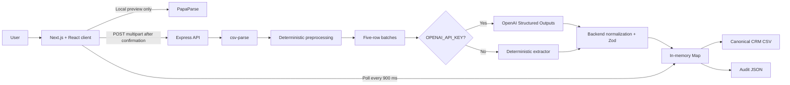

# Priority 1 — Listwright Assignment Preparation

This is the source-code-grounded guide for explaining, modifying, and debugging Listwright live. Do not memorize every sentence. Learn the flow, the ownership of each module, and the reasons behind the main decisions.

## 1. The 60-second explanation

> Listwright is a TypeScript monorepo with three workspaces: a Next.js frontend, an Express backend, and a shared package containing Zod schemas, types, constants, and the canonical CRM column list. The browser uses PapaParse to preview a CSV locally, so nothing reaches the backend until the user confirms. On confirmation, the frontend uploads the original file as multipart form data. Express validates the upload, parses and preprocesses the rows, splits them into five-row batches, creates an in-memory asynchronous job, and returns HTTP 202. Each batch is mapped through OpenAI Structured Outputs when a key exists, or through a deterministic fallback otherwise. The backend then treats that result as untrusted: it normalizes it and validates final records with Zod. The frontend polls job status every 900 milliseconds, loads paginated imported and skipped records, and exposes a canonical CRM CSV plus a richer audit JSON export. Failed batches can be retried without reprocessing completed batches.

The central design principle is:

> AI proposes semantic mappings; deterministic backend code owns truth, normalization, validation, and export.

## 2. Architecture



### Why three workspaces?

- `apps/web` owns presentation, local preview, user confirmation, polling, and result review.
- `apps/api` owns security limits, parsing, processing, domain rules, AI integration, job state, and exports.
- `packages/shared` owns contracts used by both sides. This prevents the UI and API from independently inventing status names, CRM columns, or response shapes.

### Trust boundaries

There are three different kinds of validation:

1. The OpenAI JSON Schema constrains the shape generated by the model.
2. `aiBatchResultSchema` validates the provider response at runtime.
3. Shared Zod schemas validate normalized domain records before storage/export.

This defense in depth matters because structured output gives a valid shape, not necessarily correct business meaning.

## 3. Every major file

### Repository root

| File | Responsibility | What to say |
|---|---|---|
| `package.json` | npm workspaces and root build/test/typecheck scripts | “One command coordinates shared, API, and web workspaces.” |
| `.env.example` | Runtime configuration contract | “OpenAI is optional locally; API URL, CORS, port, model, and row limit are configurable.” |
| `README.md` | Setup, demo flow, API, deployment, and tradeoffs | “This is the reviewer entry point, while source code remains authoritative.” |
| `Dockerfile.api` | Builds and runs the Express application | “API is deployed as its own Node process.” |
| `Dockerfile.web` | Builds and runs Next.js | “Web and API can scale/deploy independently, although the current API cannot safely scale horizontally.” |
| `docker-compose.yml` | Local two-container orchestration | “It wires ports and environment variables for a production-like local run.” |
| `scripts/e2e-sample-flow.mjs` | Browser smoke-test harness | “It verifies the real upload-to-export path.” |
| `samples/` | Repository fixtures | “These give repeatable demo and test inputs.” |
| `docs/` | Product, technical, UI, AI, and interview documentation | “These record intent and decisions; running code is the final truth.” |

### Shared workspace

| File | Responsibility | Key detail |
|---|---|---|
| `packages/shared/src/constants.ts` | Canonical CRM columns, enum allowlists, job statuses, default limit | CSV output order comes from `CRM_CSV_COLUMNS`. |
| `packages/shared/src/schemas.ts` | Zod schemas and inferred TypeScript types | It sanitizes strings, validates dates/enums/counts, and defines API/result contracts. |
| `packages/shared/src/index.ts` | Public exports | Callers import from `@listwright/shared`, not internal files. |
| `packages/shared/package.json` | Shared build/package configuration | Zod is a runtime dependency, not only a type tool. |

### Express API workspace

| File | Responsibility | Key detail |
|---|---|---|
| `apps/api/src/index.ts` | Process entry point | Reads `PORT`, creates the app, and listens. |
| `apps/api/src/app.ts` | Express app factory, middleware, routes, pagination, errors | Upload is memory-backed, one file, 5 MB, `.csv`, and at most 1,000 rows. |
| `apps/api/src/types.ts` | Internal job, batch, source-row, signal, and AI candidate types | These describe internal mutable state; shared schemas describe external/domain contracts. |
| `apps/api/src/parsing/csv.ts` | Server-side CSV parsing | Uses headers, accepts uneven columns, cleans values, rejects files with no data rows, and applies the row limit. |
| `apps/api/src/parsing/preprocess.ts` | Deterministic evidence extraction and chunking | Detects contacts, dates, country codes, enums, duplicates, empties, and extra contacts; chunks rows in fives. |
| `apps/api/src/ai/openai.ts` | OpenAI request, strict JSON Schema, prompt, timeout, provider-response Zod validation | Falls back only when no API key exists; a configured but failing provider causes a failed batch. |
| `apps/api/src/ai/deterministic.ts` | No-key extractor | Maps header aliases and signals into the same `AiBatchResult` shape as OpenAI. |
| `apps/api/src/validation/normalize.ts` | Final business-rule enforcement | Deterministic contacts override AI values, enums are allowlisted, invalid dates become blank, and missing-contact rows are skipped. |
| `apps/api/src/jobs/processor.ts` | Batch creation and sequential asynchronous processing | A microtask starts work after the 202 response path; failures are isolated per batch. |
| `apps/api/src/jobs/store.ts` | Process-local job storage and state derivation | A module-level `Map` stores jobs; `updateCounts` derives counts and terminal status. |
| `apps/api/src/exports/format.ts` | CSV serialization and JSON export assembly | CSV is minimal CRM data; JSON is the audit artifact. |
| `apps/api/src/app.test.ts` | Backend behavioral tests | Covers parsing, normalization, mappings, batching, retry behavior, timeouts, status, pagination, CORS, and CSV escaping. |

### Next.js web workspace

| File | Responsibility | Key detail |
|---|---|---|
| `apps/web/src/app/layout.tsx` | Root HTML, metadata, global CSS, toast host | App-wide presentation shell. |
| `apps/web/src/app/page.tsx` | `/` route | Renders the importer; there is one main screen. |
| `apps/web/src/components/ImporterApp.tsx` | Main workflow and state machine | Local parse, confirm upload, retry, polling, pagination, tabs, comparisons, and export links live here. |
| `apps/web/src/components/importer/UploadDropzone.tsx` | File selection, drag/drop, sample buttons | Delegates the selected `File` to the parent. |
| `apps/web/src/components/importer/ImporterStepper.tsx` | Accessible workflow progress | Derives completed/current/upcoming steps. |
| `apps/web/src/lib/api.ts` | API base URL, fetch/error wrapper, export URLs | Converts network and non-2xx failures into usable errors. Its generic return type is not runtime validation. |
| `apps/web/src/app/globals.css` | Entire visual system | Responsive workbench, tables, focus states, status styles, and layout. |

Generated directories, lockfile internals, screenshots, and TypeScript build-info files are not application logic.

## 4. Upload flow

### Before confirmation

1. `UploadDropzone` supplies a browser `File` to `parseFile`.
2. `parseFile` checks the `.csv` extension.
3. PapaParse reads the file in the browser with `header: true`.
4. Rows are sanitized for display and parser warnings are retained.
5. The UI renders at most the first 80 preview rows.
6. No API or OpenAI request occurs yet.

Important phrasing:

> The local parse is a UX preview, not the authoritative import. The server parses the original file again because the backend cannot trust client-derived rows.

### After confirmation

1. `confirmImport` puts the original `File` into `FormData` under `file`.
2. `apiFetch` sends `POST /api/imports`.
3. Multer enforces one file and a 5 MB limit and keeps it in memory.
4. Express rejects a missing file or a filename without `.csv`.
5. `parseCsvBuffer` parses and caps the rows.
6. `preprocessRows` produces numbered `SourceRow` objects with deterministic signals.
7. `chunkRows` creates groups of five; `createBatches` assigns state and UUIDs.
8. The API stores a queued `ImportJob`, schedules processing, and returns `202 Accepted` with the job ID.
9. The browser immediately fetches the job and starts polling.

Why `202`? The request has been accepted, but processing is not complete. This prevents the upload request from remaining open through multiple model calls.

## 5. Express API flow

Middleware and route order in `createApp`:

1. Disable `x-powered-by`.
2. Add `nosniff`, `no-referrer`, and `no-store` headers.
3. Configure Multer and clamp the row limit.
4. Configure CORS.
5. Add JSON parsing.
6. Register health, import, status, results, retry, and export routes.
7. Add JSON 404 handling.
8. Add Multer/general error middleware.

Endpoints:

| Method and path | Purpose | Main response |
|---|---|---|
| `GET /health` | Process identity/health | `{status: "ok", service: "listwright-api"}` |
| `POST /api/imports` | Accept and create an import | `202 {jobId, status, rowLimit}` |
| `GET /api/imports/:jobId` | Poll summary | `{job}` |
| `GET /api/imports/:jobId/records` | Paginated imported results | `{job, pagination, records}` |
| `GET /api/imports/:jobId/skipped` | Paginated skipped results | `{job, pagination, records}` |
| `POST /api/imports/:jobId/retry` | Requeue failed batches only | `202` plus count retried, or `200` if none |
| `GET /api/imports/:jobId/export.csv` | Download canonical CRM rows | CSV attachment |
| `GET /api/imports/:jobId/export.json` | Download full audit payload | JSON attachment |

`getJob` centralizes the 404 response. `paginate` defaults to page 1 and limit 100 and caps the limit at 200.

## 6. Batch processing

Default batch size is five rows. For 40 rows, the system creates eight batches.

`startJobProcessing` schedules `processBatches` with `queueMicrotask`, allowing the route to return immediately. This is asynchronous from the HTTP caller’s perspective, but it is not a durable worker queue.

`processBatches` runs batches sequentially:

1. Mark job `processing`.
2. Mark one batch `processing`, increment attempts, and clear its current error.
3. Call the injected extractor.
4. Normalize and validate its output.
5. Append imported records, skipped records, and mapping notes.
6. Mark that batch completed.
7. On error, mark only that batch failed and append a retryable job error.
8. Recalculate counts and status after every transition.
9. Continue to later batches even if an earlier one failed.

Status derivation:

- All batches completed → `completed`.
- All settled, some completed and some failed → `partial_failed`.
- All settled and none completed → `failed`.
- Otherwise, after work begins → `processing`.

Why five and sequential?

- Keeps prompt size and latency bounded.
- Shrinks the retry/failure domain.
- Preserves straightforward progress accounting.
- Avoids provider concurrency/rate-limit complexity in a demo.

Tradeoff: sequential calls reduce throughput. Production could use bounded concurrency and a durable queue.

## 7. Zod validation

Zod provides runtime validation. TypeScript types disappear at runtime, so they cannot protect the system from uploaded data, query values, or model output.

Important schemas:

- `CsvSafeStringSchema`: removes newlines and trims.
- `ParseableDateOrBlankSchema`: blank or parseable by `new Date`.
- `CrmRecordSchema`: all 15 canonical fields plus enum rules.
- `ImportedRecordSchema`: CRM record + source row + confidence + warnings + mapping references.
- `SkippedRecordSchema`: source row + reason + warnings.
- `ImportJobSummarySchema`: public job state and counters.
- Pagination and response schemas: shared contracts for API consumers.

Example:

```ts
const parsed = CrmRecordSchema.safeParse(normalized);
if (!parsed.success) {
  // Convert the row into an auditable skipped record.
}
```

`safeParse` is appropriate when invalid data is an expected domain outcome. `parse` is used when failure should throw and fail the current operation.

Be precise about a weakness: the backend builds responses matching shared schemas, but most route responses are not themselves passed through their response schema. The frontend also trusts `apiFetch<T>` at runtime. A stronger design would parse responses on both sides.

## 8. OpenAI Structured Outputs

`extractBatch` checks `OPENAI_API_KEY`:

- Missing key → deterministic extractor.
- Present key → `POST https://api.openai.com/v1/chat/completions`.

The request uses:

- Configurable model, default `gpt-4o-mini`.
- Temperature `0.1` for lower variability.
- `response_format.type = "json_schema"`.
- `strict: true`.
- Objects with `additionalProperties: false`.
- Explicitly required fields.
- A 45-second abort timeout.

The prompt tells the model to use headers, value shapes, and deterministic evidence; never invent facts; respect enum allowlists; skip only when both contacts are absent; and explain ambiguity with mapping notes.

After a successful response:

1. Read `choices[0].message.content`.
2. `JSON.parse` the content.
3. Validate it with `aiBatchResultSchema.safeParse`.
4. Send it to `normalizeBatchResult`.

Structured Outputs guarantee schema adherence much more strongly than “return JSON” prompting, but they do not guarantee truthful mappings, valid domain semantics, or safe business decisions. That is why backend normalization still exists.

## 9. Retries

There are two concepts interviewers may mean.

### Implemented: manual failed-batch retry

1. UI enables retry when `failedBatches > 0`.
2. `POST /retry` selects only batches whose status is `failed`.
3. It marks them `queued` and schedules only that list.
4. Completed batch results remain intact.
5. Each retried batch increments `attempts`.

This gives failure isolation and avoids paying for completed work again.

### Not implemented: automatic provider retry

There is no automatic retry loop, exponential backoff, jitter, `Retry-After` support, or maximum-attempt policy inside `extractBatch`. There is also no automatic deterministic fallback when a configured OpenAI call fails.

If asked how to add it:

- Retry only transient failures such as 408, 429, and selected 5xx/network errors.
- Do not retry permanent 4xx authentication/schema errors.
- Use exponential backoff with jitter.
- Respect `Retry-After`.
- Bound attempts and total time.
- Keep per-batch idempotency so results cannot be appended twice.
- Preserve the final error for operator review.

## 10. Polling

The UI polls because the upload route returns before processing finishes.

In `ImporterApp`, a `useEffect` starts `setInterval` at 900 ms whenever a job exists and is nonterminal. Each tick fetches `/api/imports/:jobId` and replaces local job state. Cleanup calls `clearInterval`, and terminal jobs do not start another timer.

A second effect loads imported and skipped pages when results exist or the job is terminal. It reruns when job state or a page number changes.

Strengths:

- Simple and deployable over ordinary HTTP.
- Works across reload-resistant APIs if storage is durable.
- Terminal-state cleanup prevents endless polling.

Weaknesses:

- Fixed 900 ms polling creates needless load.
- `setInterval` can overlap requests if one lasts longer than the interval.
- No backoff, visibility pause, cancellation, or transient-error threshold.
- Every job update can trigger two result requests.

Production improvement: recursive `setTimeout` after each completed request, exponential backoff, `AbortController`, pause while the tab is hidden, and eventually SSE/WebSocket for high scale.

## 11. CSV and JSON export

### CSV

`formatCrmCsv` always writes `CRM_CSV_COLUMNS` in the canonical order. It maps only imported records’ `crm` objects. `quoteCsv` flattens newlines, trims, wraps values containing commas/quotes/newlines, and doubles embedded quotes.

CSV deliberately excludes original rows, warnings, confidence, and mapping notes because it is the clean CRM import artifact.

Weakness: values beginning with `=`, `+`, `-`, or `@` are not neutralized, so spreadsheet formula injection is possible when the export is opened in spreadsheet software.

### JSON

`buildJsonExport` includes:

- export timestamp
- job summary and errors
- every imported record
- every skipped record
- original rows
- confidence and warnings
- mapping notes

JSON is the audit/review artifact. The downloaded JSON includes all records, unlike the Raw JSON UI tab, which shows only the currently fetched pages.

Server weakness: the UI unlocks exports only for terminal jobs, but the endpoints themselves do not enforce terminal status.

## 12. Weaknesses in the current implementation

Lead with judgment, not apology:

> I optimized this assignment for a reviewer-fast, auditable demo. The seams and types make the production upgrades clear, but several demo choices are intentionally not production-ready.

### Highest priority

1. **No authentication or authorization.** Anyone possessing a job UUID can read PII and exports.
2. **In-memory job storage.** Restart loses jobs; multiple instances disagree; memory has no TTL; no durable audit history exists.
3. **In-process worker.** A crash loses active work; `queueMicrotask` is not a durable queue.
4. **Retry races and duplicate appends.** Concurrent retry requests can reprocess a batch, and append-based storage has no idempotency constraint.
5. **No rate limits or quotas.** Upload and model endpoints are abuse/cost risks.

### Correctness and resilience

6. No automatic OpenAI transient retry/backoff.
7. Fixed-interval polling may overlap requests and creates avoidable load.
8. Response payloads are not consistently runtime-validated at route/client seams.
9. Pagination accepts fractional numbers because it does not enforce integers.
10. A file with exactly the row limit can receive a misleading truncation warning.
11. Header/regex heuristics can misclassify ambiguous columns, dates, and international phone numbers.
12. Phone normalization assumes the last ten digits are the local mobile.
13. Duplicate detection depends on normalized object serialization and only warns; it does not skip/merge.
14. Historical errors remain after a successful retry, which is auditable but can confuse current-state display.

### Security and scale

15. Upload uses memory storage and checks extension, not MIME/content signature or encoding.
16. CSV export lacks formula-injection protection.
17. Raw PII has no retention, deletion, encryption, or ownership policy.
18. Export endpoints do not enforce terminal status.
19. No request IDs, structured logs, metrics, tracing, or provider-cost telemetry.
20. Frontend local parsing can freeze on very large files; preview is rendered at 80 rows but the full file is still parsed/stored.

### Production roadmap

1. Add auth, tenant ownership, and access checks.
2. Move jobs/results to Postgres with retention and idempotency constraints.
3. Move batches to Redis/SQS/BullMQ or another durable worker system.
4. Add bounded concurrency, transient retry/backoff, rate limits, and observability.
5. Validate every external request and response with schemas.
6. Stream large CSVs and harden exports.

## 13. Modify a function live

Use this safe five-step routine:

1. Restate the requested behavior and one edge case.
2. Locate the smallest owning module.
3. Add or adjust a focused test first when practical.
4. Make the smallest change; do not refactor unrelated code.
5. Run the focused test, then typecheck and the wider suite.

### Likely exercise A: make `chunkRows` safe

Current weakness: `size = 0` creates an infinite loop.

Desired contract:

```ts
export function chunkRows(rows: SourceRow[], size = 5) {
  if (!Number.isInteger(size) || size <= 0) {
    throw new Error("Batch size must be a positive integer");
  }
  const batches: SourceRow[][] = [];
  for (let index = 0; index < rows.length; index += size) {
    batches.push(rows.slice(index, index + size));
  }
  return batches;
}
```

Test cases: size 2 creates `[2, 2, 1]`; size 0 throws; fractional size throws; empty rows returns `[]`.

### Likely exercise B: harden pagination

Current weakness: `page=1.5` can produce a fractional slice offset.

Explain before editing:

> Query strings are untrusted runtime values. I would coerce them to numbers, require positive integers, apply defaults, and cap the limit.

Use Zod coercion or a small integer parser, then test negative, fractional, nonnumeric, and huge inputs.

### Likely exercise C: prevent CSV formula injection

Before normal CSV quoting, prefix dangerous spreadsheet-leading characters with an apostrophe. Test `=SUM(1,1)`, `+cmd`, `-1`, and `@value`, while discussing whether negative numeric values should be preserved based on the product contract.

### Commands during a live change

```bash
npm test -w @listwright/api
npm run typecheck
npm run lint
npm run build
```

Narrate what you are doing. Silence makes a correct edit look uncertain.

## 14. Debug a failure live

Use this loop:

> Reproduce → minimize → rank hypotheses → instrument one seam → fix → regression-test → clean up.

### First questions

- What exact action fails?
- Is it local preview, upload, processing, polling, result loading, retry, or export?
- What are the HTTP status, response body, browser console error, and API log?
- Does deterministic mode reproduce it?
- Does one sample file reproduce it every time?

### Failure map

| Symptom | First seam to inspect | Likely causes |
|---|---|---|
| Preview never appears | Browser/PapaParse | wrong extension, parser error, huge file, client exception |
| “Could not reach import service” | `apiFetch`/network | API down, wrong base URL, CORS, DNS/TLS |
| Upload returns 400 | Multer/CSV parser | missing field, >5 MB, malformed/no data rows |
| Upload returns 415 | Express extension check | filename is not `.csv` |
| Job stays processing | processor/store | slow provider call, stuck request, state update bug |
| One batch fails | extractor/normalizer | timeout, 429/5xx, invalid JSON, Zod failure |
| Job disappears | in-memory store | API restart or request routed to another instance |
| Counts look wrong after retry | processor/store | duplicate processing, append duplication, concurrent retry |
| Polling spams or overlaps | React polling effect | short fixed interval, slow network, rerender/effect behavior |
| CSV columns/escaping wrong | export formatter/constants | column order drift or quoting bug |
| UI data shape crashes | API/client seam | `apiFetch<T>` trusted invalid runtime JSON |

### Concrete debugging example: OpenAI batch fails

1. Reproduce with one five-row batch and capture the exact job error.
2. Run without `OPENAI_API_KEY`. If deterministic mode succeeds, parsing and normalization are probably healthy and the provider seam becomes the focus.
3. Rank falsifiable hypotheses:
   - Timeout: a longer controlled timeout or mocked fast response makes it pass.
   - Rate limit/provider error: status is 429/5xx and headers/body show it.
   - Structured response mismatch: HTTP is 200 but `aiBatchResultSchema` fails.
   - Prompt/input size issue: a smaller/minimized row succeeds.
4. Add targeted temporary logging with a unique prefix, excluding secrets and raw PII.
5. Convert the minimized reproduction into a test using the injectable extractor in `processBatches`.
6. Fix only the confirmed cause.
7. Verify the original scenario, focused test, full tests, and removal of temporary logs.

Never start by randomly editing the prompt, adding broad `try/catch`, or logging the API key/full lead rows.

## 15. High-probability interview questions

### Why parse twice?

The browser parse creates a fast privacy-preserving preview. The server parse is authoritative because client state is untrusted and can be bypassed.

### Why not send all rows to OpenAI at once?

Five-row batches bound token usage, latency, and failure impact. Retrying one failed batch is cheaper and safer than rerunning the whole file.

### Why have a deterministic fallback?

It makes the entire assignment reviewable without credentials and provides an explainable baseline. It returns the same candidate shape, so downstream normalization and validation do not fork.

### Why is the AI not the source of truth?

Models can produce semantically wrong values even with valid structured JSON. Deterministic code enforces contacts, allowlists, dates, skip rules, and exports.

### What happens to every source row?

During normalization it becomes either an imported record or a skipped record. Missing both email and mobile is the main skip rule; final Zod failure also creates an auditable skip.

### What happens when batch 2 of 8 fails?

Batch 2 becomes failed with a retryable error, batches 3–8 continue, and the terminal job becomes `partial_failed` if any other batch completed. Retry selects only failed batches.

### Is this really background processing?

It is asynchronous in-process processing scheduled by a microtask, not a durable background worker. The 202/polling interface is appropriate, but the implementation must move to a real queue for production reliability.

### Why shared Zod schemas?

They combine runtime contracts with inferred TypeScript types and stop API/client/domain constants from drifting. They do not remove the need to actually call `.parse` at external seams.

### What would you change first?

For production: auth/ownership, durable storage/queue, then idempotent batch processing and rate limiting. These address PII exposure and data-loss/duplication risks before performance polish.

## 16. Practice drills

### Ten-minute architecture drill

Without looking at code, draw:

`File → local preview → confirmation → multipart upload → server parse → signals → batches → OpenAI/fallback → normalize/Zod → Map → polling → results → exports`

Then identify the exact owning file for every arrow.

### Five-minute code navigation drill

Find these in under 30 seconds each:

- Batch size: `preprocess.ts`
- OpenAI timeout: `openai.ts`
- Skip rule: `normalize.ts`
- Poll interval: `ImporterApp.tsx`
- Row/file limits: `app.ts` and shared constants
- CSV column order: shared constants
- Job state machine: `store.ts`
- Retry route: `app.ts`

### Live-change drills

1. Validate `chunkRows` size.
2. Require integer pagination.
3. Add CSV formula-injection defense.
4. Add a new deterministic header alias and its test.
5. Add an `AbortController`-based non-overlapping polling helper.

### Live-debug drills

1. Break `NEXT_PUBLIC_API_BASE_URL` and diagnose the network error.
2. Make an extractor throw for the first batch and explain `partial_failed`.
3. Return confidence `1.5` from a mock extractor and trace the validation failure.
4. Restart the API after creating a job and explain the 404.
5. Trigger two retry requests and discuss the race/idempotency fix.

## 17. Final checklist

Before the interview, you should be able to do all of these without notes:

- Give the 60-second architecture explanation.
- Name the three workspaces and their responsibilities.
- Trace upload from browser file to HTTP 202.
- Trace one row through preprocessing, extraction, normalization, and Zod.
- Explain every job state and batch state.
- Distinguish structured shape from semantic correctness.
- Distinguish manual batch retry from automatic provider retry.
- Explain polling setup and cleanup.
- Explain why CSV and JSON contain different data.
- Name the top five production weaknesses honestly.
- Modify one pure function with a focused test.
- Debug by reproducing and testing hypotheses instead of guessing.

The strongest closing sentence is:

> The assignment is intentionally simple in infrastructure but strict at the data trust boundary: the model helps interpret messy input, while deterministic code keeps the result bounded, auditable, and export-safe—apart from the production hardening items I have identified.
